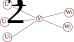

*********************
Model implementation
*********************

En esta sección se describe la implementación del modelo numérico
para hacer la integración de las variables.

Implementación del diagrama de flujo
====================================

El diagrama de flujo de las variables:

.. image:: ../images/flow_02.svg 
    :target: ../images/flow_02.svg
    :width: 300 px                
    :align: center                

Se puede plantear como un grafo bidireccional dirigido, donde los
nodos contienen los valores de las variables a medida que se hace
evolucionar el sistema y las aristas contienen diferentes valores, por
ejemplo las probabilidades de transición o los tiempos de retardo.

Este tipo de objeto se construye instanciando la clase
:class:`cv19.Graph`.  

Ejemplo de uso:

.. code:: python

    from cv19 import Graph

    g = Graph()

    for i, inode in enumerate(['A','B','C','D']):
        print(i)
        g.add_node(inode, 0)

    nms = ['x', 'y']
    g.add_edge('A', 'B', nms, [1, 100])
    g.add_edge('A', 'C', nms, [2, 200])
    g.add_edge('B', 'D', nms, [3, 300])
    g.add_edge('D', 'B', nms, [4, 400])
    g.add_edge('D', 'C', nms, [5, 500])
    g.add_edge('C', 'C', nms, [6, 600])

    g.add_edge('B', 'D', nms, [333, 333])

    g.show()

Modelo de contagios con grafos
==============================

Con la clase :class:`cv19.Graph` se puede crear un grafo y agragar un
estado en cada nodo, con valor inicial cero para todos los estados
menos para el estado I, que comienza con un valor de por lo menos uno:

.. code:: python

    g = Graph()
    
    for node in ['I','C','R','H','B','U','D',]:
        g.add_node(node, 0)
    
    g.set_node('I', p.N_init)

Ahora podemos agregar en las aristas las cosas que necesitamos. Para
cada arista vamos a agregar un *lag* y una probabilidad de transición.
Para el estado I el *lag* es cero y la probabilidad es la tasa de
transmisión.   El contador del estado I disminuye cuando hay
transferencias del estado I al R.

.. code:: python

    g.add_edge('I', 'I', nms, [p.R,  0])

Esto nos va a permitir actualizar el valor de I según:

.. math::

    I(t+dt) = I(t) + I(t) * R * dt

En esta versión I siempre crece, asi que habría que restarle los casos
que se recuperan o fallecen.  Es decir, hay que incorporar la
trnasición :math:`I \rightarrow C`.

.. math::

    I(t+dt) = I(t) + I(t) * R * dt - C(t) * P(C|I, t) * dt

En general, dada una variable :math:`V`, su variación se incrementa
por todas las variables :math:`U` que tienen transiciones 
:math:`U \rightarrow V` y disminuye por 
todas las variables :math:`W` que tienen transiciones 
:math:`I \rightarrow W`.

.. math::

    V(t+dt, q) = V(t, q) + \sum_i U(t, q) \cdot P(V|U, q) \cdot dt -
                 \sum_i W(t, q) \cdot P(V|W, q) \cdot dt

Por ejemplo, si tenemos un grafo como este:

La variacion del nodo V está dada por:

.. math::

    V(t+dt, q) = V(t, q) + U_1(t, q) \cdot P(V|U_1, q) \cdot dt +\\
                         + U_2(t, q) \cdot P(V|U_2, q) \cdot dt +\\
                         + U_3(t, q) \cdot P(V|U_3, q) \cdot dt -\\
                         - W_1(t, q) \cdot P(W_1,V, q) \cdot dt -\\ 
                         - W_2(t, q) \cdot P(W_2,V, q) \cdot dt  

Aquí por ejemplo :math:`P(V|U_1, q)` significa probabilidad de que
haya una transición del estado :math:`U_1` al estado :math:`V`.
                         

Teniendo en cuenta que:

- los parámetros parseados del archivo .ini están en la lista de parámetros p,
- los tiempos de lag están en unidades de días (si no, hay que pasarlos)
- todos los infectados acusan síntomas al día p.t_incubation

resulta el código para llevar la cuenta de I así:

.. code:: python

    g = Graph()
    
    for node in ['I','C','R','H','B','U','D',]:
        g.add_node(node, 0)
    
    nms = ['prob','lag']
    g.set_node('I', p.N_init)
    g.add_edge('I', 'I', nms, [p.R,  0])
    g.add_edge('I', 'C', nms, [1. p.t_incubation])

    t = 0.
    time_steps = 0
    
    while t < p.t_max:
    
        time_steps = time_steps + 1
    
        t_prev = t
        t = t + p.dt
        ts.append(t)
    
        prob_II = g.get_edge('I', 'I', 'prob')
        lag_II  = g.get_edge('I', 'I', 'lag')
        prob_IC = g.get_edge('I', 'C', 'prob')
        lag_IC  = g.get_edge('I', 'C', 'lag')

        n_I = I[-1] + I[-lag_II] * prob_II * p.dt - \
              C[-lag_IC] * prob_IC * p.dt
        I.append(n_I)      

Implementación de un modelo
==============================

Para el modelo de la figura

.. image:: ../images/flow_02.svg   
    :target: ../images/flow_02.svg  
    :width: 300 px                  
    :align: center                  

Las transiciones son:

+----------+----------------+----------------+
| estado   + suma           +         resta  +
+==========+================+================+
| I        | I              | C              |
+----------+----------------+----------------+
| C        | I              | B, H, U        |         
+----------+----------------+----------------+
| H        | C, B, U        | R, B, U        | 
+----------+----------------+----------------+
| B        | C, H, U        | H, U           | 
+----------+----------------+----------------+
| U        | C, B, H        | D, B, H        | 
+----------+----------------+----------------+
| R        | H              |                | 
+----------+----------------+----------------+
| D        | U              |                | 
+----------+----------------+----------------+

Versión probabilística
======================

En la version probabilística, los cambios en los valores de los
estados dependen de las características de la población en esos
estados.  Por ejemplo, las transiciones :math:`B \rightarrow U`
dependen de la edad de los pacientes.  El modelo anterior se puede 
extender para una versión probabilística de la siguiente forma:

.. math::

    V(t+dt, q) = V(t, q) + \sum_i U(t, q) \cdot P(V|U, q) \cdot dt -
                 \sum_i W(t, q) \cdot P(V|W, q) \cdot dt

Tabulaciones de las distribuciones de probabilidad
==================================================

Tasas de mortalidad como función de la edad
-------------------------------------------

Distribución de la edad poblacional
-------------------------------------------

Tiempos de permanencia en UTI como función de la edad
-----------------------------------------------------

etc. ...

