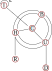

***********
Models
***********

Descripción de un modelo con diagramas de flujo
===============================================

El diagrama de flujo de las variables:

Se puede plantear como un grafo bidireccional dirigido, donde los
nodos contienen los valores de las variables a medida que se hace
evolucionar el sistema y las aristas contienen diferentes valores, por
ejemplo las probabilidades de transición o los tiempos de retardo.

Esta arquitectura se puede aplicar al problema de la difusión de una
enfermedad virósica, teniendo en cuenta que cada individuo de la
población se puede considerar que pertenece a algunas de las
siguientes categorías:

+----------+--------------------------------------+
| estado   + descripción                          +
+==========+======================================+
| S        | Susceptible de ser contagiado        |
+----------+--------------------------------------+
| E        | Expuesto a una situación de contagio |
+----------+--------------------------------------+
| I        | Infeccioso (capacidad de contagiar)  |
+----------+--------------------------------------+
| R        | Recuperado                           |
+----------+--------------------------------------+
| F        | Fallecido a causa del virus          |
+----------+--------------------------------------+
| C        | Confirmado positivo con test         |
+----------+--------------------------------------+
| H        | Enfermo en el hogar                  |
+----------+--------------------------------------+
| B        | Enfermo en una cama del sist. sanit. |
+----------+--------------------------------------+
| U        | Enfermo en unidad de terapia intens. |
+----------+--------------------------------------+

Se pueden formular diferentes modelos y no todas las categorías, 
o clases, o compartimientos participan.

Modelo SI
---------

El modelo más simple considera sólo dos estados, I y R.  En este
modelo se hacen las siguientes hipótesis:

- una vez que un paciente se infecta, permanece infectado para siempre
- el sistema es cerrado: N = S + I
- Hay sólo una transferencia, :math:`S \rightarrow I`, es decir, que
  una persona sana se infecte, lo cual ocurre con probabilidad :math:`\beta`, 
  la "tasa de infección".

Las ecuaciones del modelo son:

.. math::
    :nowrap:

    \begin{eqnarray}
    dS/dt &=& - \beta S I/N \\
    dI/dt &=&  \beta S I/N \\

    \end{eqnarray}

 

Modelo SIR
----------

Modelo SEIR
-----------

Implementación de un modelo
==============================

Para el modelo de la figura

Las transiciones son:

+----------+----------------+----------------+
| estado   + suma           +         resta  +
+==========+================+================+
| I        | I              | C              |
+----------+----------------+----------------+
| C        | I              | B, H, U        |         
+----------+----------------+----------------+
| H        | C, B, U        | R, B, U        | 
+----------+----------------+----------------+
| B        | C, H, U        | H, U           | 
+----------+----------------+----------------+
| U        | C, B, H        | D, B, H        | 
+----------+----------------+----------------+
| R        | H              |                | 
+----------+----------------+----------------+
| D        | U              |                | 
+----------+----------------+----------------+

Para este modelo, la actualización de un paso temporal para I es:

.. math::

    I(t+dt) = I(t) + I(t-\tau_{II}) \cdot P(I|I) \cdot dt -
               C(t-\tau_{IC}) \cdot P(C|I) \cdot dt

donde :math:`\tau_{II}` es el time lag para la transición 
:math:`I \rightarrow I`, y
:math:`\tau_{IC}` es el time lag para la transición 
:math:`I \rightarrow C`.  Los valores P son las probabilidades de
transición, es decir, :math:`P(C(t)|I(t-\tau_{IC}))` es la probabilidad de que un
individuo pase al estado C en el tiempo t si estaba en el estado I en
el tiempo :math:`t-\tau_{IC}`.  Por supuesto, :math:`P(I(t)|I(t-\tau_{II}))`
es la probabilidad de permanecer en el estado I durante el tiempo
:math:`\tau_{II}`.

Para el contador de "confirmados", C, tenemos que:

.. math::
    :nowrap:

    \begin{eqnarray}
    C(t+dt) = C(t)  &+& I(t-t_{CC}) \cdot P(C(t)|I(t-\tau_{IC}) \cdot dt -\\
            &-&  C(t-\tau_{CH}) \cdot P(H(t)|C(t-\tau_{CH}) \cdot dt - \\
            &-&  C(t-\tau_{CB}) \cdot P(B(t)|C(t-\tau_{CB}) \cdot dt - \\
            &-&  C(t-\tau_{CU}) \cdot P(U(t)|C(t-\tau_{CU}) \cdot dt 
    \end{eqnarray}

porque sólo se puede llegar al estado C desde el estado I, y se puede
pasar desde el estado C a los estados H, B o U con diferentes
probabilidades.  Los tiempos de retardo desde C son cero, porque se
pueden pensar a los estados H, B y U como subestados de C, es decir, 

.. math::

   C = H + B + U

De la misma forma, para las transiciones 
:math:`B \rightarrow H`, 
:math:`B \rightarrow U`, 
:math:`H \rightarrow R`, 
:math:`H \rightarrow B`, 
:math:`H \rightarrow U`, 
:math:`U \rightarrow H`, 
:math:`U \rightarrow B` y
:math:`U \rightarrow D`, tenemos las siguientes relaciones:

.. math::
    :nowrap:

    \begin{eqnarray}
    B(t+dt) = B(t)  &+& C(t-t_{BB}) \cdot P(B(t)|C(t-\tau_{CB}) \cdot dt +\\
            &+&  H(t-\tau_{HB}) \cdot P(B(t)|C(t-\tau_{HB}) \cdot dt + \\
            &+&  U(t-\tau_{UB}) \cdot P(B(t)|C(t-\tau_{UB}) \cdot dt - \\
            &-&  U(t-\tau_{UB}) \cdot P(U(t)|B(t-\tau_{UB}) \cdot dt 
    \end{eqnarray}

y análogamente para los otros nodos.  Como se puede ver, hay una
estructura que persiste en todos los casos, y se puede escribir de
manera general.  Para un nodo V, la variación en un paso temporal está
dada por:

.. math::
    :nowrap:

    \begin{eqnarray}
    V(t+dt) = V(t)  &+& \sum_{i \in incoming} W_i(t-\tau_{}) \cdot P(V(t)|W_i(t-\tau_{W_i\,V}) \cdot dt  -  \\
                    &-& \sum_{i \in outgoing} V(t) \cdot P(W_i(t)|V(t-\tau_{VW_i}) \cdot dt
    \end{eqnarray}

Versión probabilística
======================

En la version probabilística, los cambios en los valores de los
estados dependen de las características de la población en esos
estados.  Por ejemplo, las transiciones :math:`B \rightarrow U`
dependen de la edad de los pacientes.  El modelo anterior se puede 
extender para una versión probabilística de la siguiente forma:

.. math::

    V(t+dt, q) = V(t, q) + \sum_i U(t, q) \cdot P(V|U, q) \cdot dt -
                 \sum_i W(t, q) \cdot P(V|W, q) \cdot dt

Tabulaciones de las distribuciones de probabilidad
==================================================

Tasas de mortalidad como función de la edad
-------------------------------------------

Distribución de la edad poblacional
-------------------------------------------

Tiempos de permanencia en UTI como función de la edad
-----------------------------------------------------

etc. ...

 
