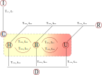

Proposal
===========

Servicio para recabar datos de tablas y hacer una predicción de diferentes parámetros relacionados con la epidemia de Covid19

Los datos a recabar son:
- configuracion del experimento, a partir de parámetros ajustados a los datos disponibles
- datos demográficos

Resultado: evolución con el tiempo de los siguientes parámetros, con sus respectios errores:

- Cantidad de personas infectadas
- Cantidad de camas necesarias

El experimento es probabilístico y hace uso de algoritmos de simulación

______

El planteo se basa en el gráfico de flujo de individuos entre los
diferentes estados en que puede estar respecto de el contagio con el
virus:

I:
   Número de Infectados
C:
   Número de Confirmados
H:
   Número de confirmados en tratamiento domiciliario
B:
   Número de confirmados en cama común en un centro de salud
U:
   Número de confirmados en una unidad de terapia intensiva
R:
   Número de confirmados con recuperación registrada
D:
   Número de confirmados difuntos

Las relaciones entre las variables I, C y (B+H+U) están dadas por los
modelos de propagación de infecciones, por ejemplo el modelo SEIR.

En este caso se hace una implementación numérica para analizar 
variables que no se pueden (?) analizar con el modelo, por ejemplo:

- Usar distribuciones de probabilidad para los diferentes parámetros
- Considerar la incorporación de casos importados
- Calcular la necesidad de camas
- etc (?!)

La transferencia de individuos entre los diferentes estados está
determinada por dos cosas:

- La probabilidad de transferencia (f)
- El tiempo de retardo (T)
- Los parámetros propios del individuo

Por ejemplo, la probabilidad de transferencia del estado U al D es la
tasa de mortalidad, y ocurre cierto tiempo después de que el paciente
ingresa al estado U.

El modelo se puede representar por:

   Representación del modelo como un diagrama de flujo

+--------------------------------------+-----------------------------------+
| .. image:: ../images/flow_02.svg     | .. image:: ../images/flow_03.svg  |
|    :target: ../images/flow_02.svg    |    :target: ../images/flow_03.svg |
|    :width: 300 px                    |    :width: 300 px                 |
|    :align: center                    |    :align: center                 |
+--------------------------------------+-----------------------------------+
| Modelo donde solo se puede pasar a   | Modelo donde se puede pasar de    | 
| D desde el estado U                  | los estados H, B y U al D         |
+--------------------------------------+-----------------------------------+

En una simulación, se puede implementar de manera muy simple el modelo
considerando (pequeños) incrementos.  Por ejemplo, para una variable
:math:`W`
que depende de otras variables :math:`V_i,\,i=1,2,...,n` 

.. math::

   \frac{dV}{dt} = f(V_1, V_2, ..., V_n)

y si la función es lineal:

.. math::

   \frac{dV}{dt} = a_1 \cdot V_1 + a_2 \cdot V_2 + ... + a_n \cdot V_n

se puede integrar de manera numérica, en primera aproximación, como:

.. math::

   V(t+dt) = V(t) + (a_1 \cdot V_1 + a_2 \cdot V_2 + ... + a_n \cdot V_n) \cdot dt 

